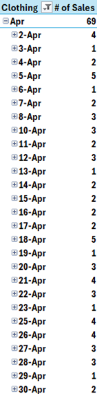

Work Done in June

# Searched Kaggle for a dataset

- Look for something interesting, practical, and simplistic for a beginner

# Explored the data in Excel

- Identified data to clean up
  - Distinguished alphanumeric user ids for future information analysis
  - Explored into the inconsistency in date formatting: Some with slashes, and some in dashes. Made it consistent by formatting as YYYY/MM/DD.

# Utilized pivot tables to summarize key information

- Sum of revenue - all within the same amt

- Explore the success of top earning category versus lowest
  - 14.78% increase in profit from electronics to clothing
  - Investigated why: Compared their # of sales, average price, and average discount of the items

Metrics were all close.

- Potential Next steps
  - Create what if scenarios for increasing avg discount of electronics from 19.27% to 20%
  - Investigate items that may be outperforming others

All 531 instances of clothing were unique. No sales were heavily dependent on one “star” item. Unrealistic data for the real world, but debunks an outperforming item for this particular dataset.

- - Look for outlier items with drastic price differences
    - Place into buckets for items that are making good sales. I.e. prices > 400, 300 to 400, with and without discounts?
    - Check for time trends - Seasonal growth or slow downs?

# 7/4

# Checked Monthly revenue for clothing

 

- April is the highest month at 15,877
- Avg for 11 months is 10,665
- April is 49% higher than the average month for clothing

# 7/5

# Why the success in April?
 

- April saw more transactions than the other months, at 69.
- April has an above average transaction price, at 230
- Discounts did not have a correlation with # of sales - A higher discount did not necessarily mean it contributed to more transactions.
- \# of sales were spread uniform throughout the month, a bulk of transactions in one day was not the cause of higher sales.
- **Conclusion -** Because the cost of items has a significant range in price, a higher # of sales is likely to result in more revenue. Keeping in mind the exception that the items being sold aren’t a bulk of low cost items.
  - Potential Next Steps for deeper dives: Investigate why April had way more sales(may not be contained in the data itself): Seasonal trend, celebrity influence, specific items being sold? Newer customers?

# 7/6

# Does the Pattern Hold for the Bigger Picture?

Is the volume of transactions the key driver of success for the other categories?

- Since we do not have access to profit margins within the data, we can assume that more sales will result in higher profit.
- While high transaction volume is necessary, it alone is not an indicator of success. Within the data, the value of the order is also important.
- **Conclusion:** \# of sales + Average Cost are the factors we need to focus on to retain/grow the business.

# Taking Another Look at Discounts for its Relevance

- If # of sales and average costs are important for revenue, we need to take a look at how to reproduce that, or influence it. Discounts may be the key for it.
- From earlier data, discounts did not seem to affect # of sales.
- For the cost of sales, we need to now take a look at its impact:

**Placing Discount % into Buckets for Discount Ranges**

- Used a lookup function to separate discount % 's into ranges(0-10%, 11-20%, etc) - To be used in pivot tables to see its correlation with sales impact.
