# Overview of Project
- Searched Kaggle for a dataset
  - Looked for something interesting, practical, and simplistic for a beginner
- Cleaned Excel data, analyzed data utilizing pivot tables to generate insights on business performance across multiple sectors.
- Cross-checked the impact of variables in accordance with each other such as discounts, pricing structure, and time sold in.
- Generated simple charts in Excel to forecasts revenue predictions.
- Recreated charts using Tableau to get a sense of the web-application, and to explore it's storytelling tools.
- Used python to practice loading and querying the data via SQLite. Not essential to analysis, but can be used to scale project further
# TODO
  - Separate notes into Analysis Insights and a polished README
  - predictive analytics: python projective forecasts
  - Additional Tableau Dashboard Elements
  - in-depth price tiers revenue analysis

# Explored the data in Excel

- Identified data to clean up
  - Distinguished alphanumeric user ids for future information analysis
  - Explored into the inconsistency in date formatting: Some with slashes, and some in dashes. Made it consistent by formatting as YYYY/MM/DD.

# Analysis on Overall Revenue and its Potential Drivers

- Sum of revenue - all within the same amt

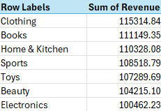

- Explore the success of top earning category versus lowest
  - 14.78% increase in profit from electronics to clothing
  - Investigated why: Compared their # of sales, average price, and average discount of the items

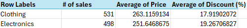

Metrics were all close.

- Potential Next steps
  - Create what if scenarios for increasing avg discount of electronics from 19.27% to 20%
  - Investigate items that may be outperforming others

All 531 instances of clothing were unique. No sales were heavily dependent on one “star” item. Unrealistic data for the real world, but debunks an outperforming item for this particular dataset.

- - Look for outlier items with drastic price differences
    - Place into buckets for items that are making good sales. I.e. prices > 400, 300 to 400, with and without discounts?
    - Check for time trends - Seasonal growth or slow downs?

# Analysis on Monthly Revenue for Clothing

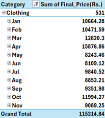 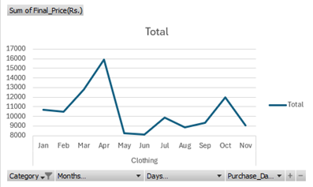

- April is the highest month at 15,877
- Avg for 11 months is 10,665
- April is 49% higher than the average month for clothing

# Exploring a High Performing Month in April
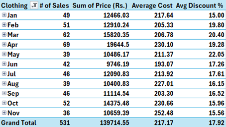 
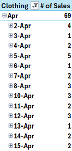 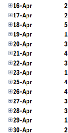

- April saw more transactions than the other months, at 69.
- April has an above average transaction price, at 230
- Discounts did not have a correlation with # of sales - A higher discount did not necessarily mean it contributed to more transactions.
- \# of sales were spread uniform throughout the month, a bulk of transactions in one day was not the cause of higher sales.
- **Conclusion -** Because the cost of items has a significant range in price, a higher # of sales is likely to result in more revenue. Keeping in mind the exception that the items being sold aren’t a bulk of low cost items.
  - Potential Next Steps for deeper dives: Investigate why April had way more sales(may not be contained in the data itself): Seasonal trend, celebrity influence, specific items being sold? Newer customers?

# Exploring the Significance in Transaction Volume

Is the volume of transactions the key driver of success for the other categories?

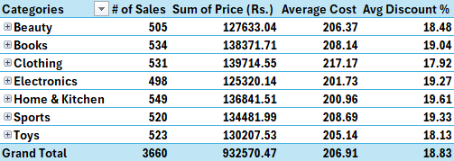

- Since we do not have access to profit margins within the data, we can assume that more sales will result in higher profit.
- While high transaction volume is necessary, it alone is not an indicator of success. Within the data, the value of the order is also important.
- **Conclusion:** \# of sales + Average Cost are the factors we need to focus on to retain/grow the business.

# Taking Another Look at the Impact of Discounts

- If # of sales and average costs are important for revenue, we need to take a look at how to reproduce that, or influence it. Discounts may be the key for it.
- From earlier data, discounts did not seem to affect # of sales.
- For the cost of sales, we need to now take a look at its impact:

**Placing Discount % into Buckets for Discount Ranges**

- Used a lookup function to separate discount % 's into ranges(0-10%, 11-20%, etc) - To be used in pivot tables to see its correlation with sales impact.

**Analyzing the Average Cost of Sales for each Discount Bucket**
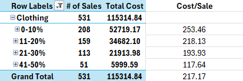

- Lower discounts offer the highest revenue overall - Cost Per sale, # of Sales
- As Discount % increases, the # of sales decreases
- Higher discounts bring in extra sales, but at a lower cost per sale
- **Factors to Consider**
  - What items are in demand?
    - Items in demand can be set at lower discounts.
  - What items are being viewed?
    - Perhaps a discount can convert a customer towards a purchase.

# Taking a look at Best Pricing Structures
**Question: Which price tiers generate the most revenue?**
  - Each category is grouped into pricing tiers for analysis.
  - The number of transactions is counted within each tier to identify the bulk of consumer interests based on pricing.
  
  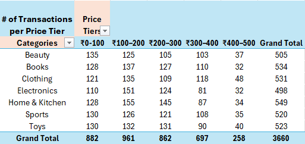
  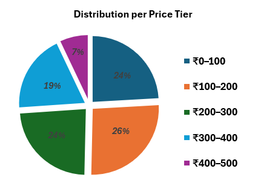

  **Analysis**
  - Again, because the data is synthetic - The number of transactions is neatly uniform among all categories.
  - If we were to treat the data seriously:
    - Most transactions are concentrated in ₹0 to ₹300.
    - ₹100 - ₹200 is the hottest performer
      - 961 purchases being a 9% increase than the 2nd highest in 882 purchases.
    - ₹300 - ₹400 experiences volume decrease, and anything above ₹400 starts to crater.

# Forecasting Revenue Predictions  
- Due to the incomplete data in November, it was excluded from the values - A forecast from Nov 2024 to Apr 2025 was made from the existing data in Jan to Oct 2024.
- The baseline trend hovers around an average of ₹70,000, with some dips, recoveries, and spikes in between.
- A forward-looking forecasts suggests similar ups and downs, with it stabilizing around ₹72,000.

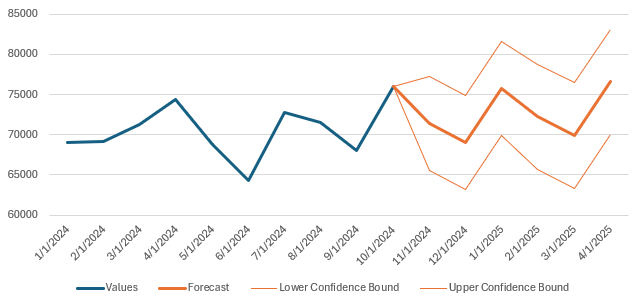